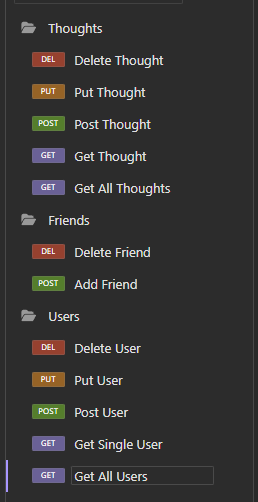

# Social-Media-Database

## Description
In this project I was able to manger through the models and spi much better and with the help of
the teaching material I got it all to work. The one I struggled the most with would be the
controllers and working them with Insomnia.

## Table of Contents
* [User Story](#user-story)

* [Acceptance Criteria](#acceptance-criteria)

* [Installation](#installation)

* [Images](#images)

* [Links](#links)

## User Story

```md
AS A social media startup
I WANT an API for my social network that uses a NoSQL database
SO THAT my website can handle large amounts of unstructured data
```

## Acceptance Criteria

```md
GIVEN a social network API
WHEN I enter the command to invoke the application
THEN my server is started and the Mongoose models are synced to the MongoDB database
WHEN I open API GET routes in Insomnia for users and thoughts
THEN the data for each of these routes is displayed in a formatted JSON
WHEN I test API POST, PUT, and DELETE routes in Insomnia
THEN I am able to successfully create, update, and delete users and thoughts in my database
WHEN I test API POST and DELETE routes in Insomnia
THEN I am able to successfully create and delete reactions to thoughts and add and remove friends to a user’s friend list
```

## Installation
npm i express
npm i mongoose

## Images


## Links
Github: [Link text](https://github.com/Christopher-VA)
Email: [link text](cvonaltenstadt@gmail.com)